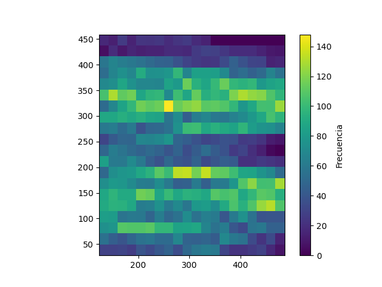

# Laboratorio 01: Cálculo de frecuencia peatonal 

## 1. Introducción 

El experimento con el que se trabajará se realizó dentro del proyecto *BaSiGo* (Bausteine ​​für die Sicherheit von Großveranstaltungen). El proyecto fue financiado por el Ministerio Federal de Educación e Investigación (BMBF) dentro del programa “Investigación para la Seguridad Civil”.

Este se llevó a cabo en nueve carreras en las que se varió la densidad de personas dentro del corredor cambiando los anchos (b_1 y b_2). Para acortar el tiempo de preparación entre las carreras individuales, los peatones fueron enviados alternativamente desde ambos lados por la geometría construida simétricamente.

### 1.1 Justificación 

El estudio de los flujos peatonales en ciertos espacios urbanos presenta una alta importancia debido a que permite optimizar el diseño y planificación de infraestructuras, además:
- Tener espacios públicos eficientes (metros, por ejemplo) mejora considerablemente el flujo peatonal, permitiendo brindar una mayor satisfacción y mejor experiencia a los usuarios.
- Estos estudios permiten también mejorar la seguridad de los peatones, identificando los puntos de conflicto y como se mueven las personas.

### 1.3 Objetivos 

**Objetivo General**

Procesar la base de datos del estudio para su próximo análisis mediante el uso de librerias, listas, diccionarios, etc.

**Objetivos específicos**

1. Explorar y entender la base de datos.
2. Limpiar y extraer los datos necesarios, en este caso las coordenadas a utilizar.
3. Manipular los datos filtrados según lo solicitado (transformar de metros a pixeles).
4. Confeccionar mapas de calor para un análisis más interactivo.

## 2. Marco teórico

A continuación se presentan una serie de herramientas, estructuras y librerías que se utilizarán a lo largo del laboratorio:

*Conda*: Se usará para la gestión de paquetes, ya sea buscar, instalar, actualizar o eliminarlos. A su vez permitirá crear y gestionar entornos virtuales que contendrá las bibliotecas necesarias para un proyecto en específico.

*Ipython*: Permitirá que la programación mediante Python se vuelva más eficiente e interactiva, utilizando diversas bibliotecas de análisis de datos.

*Visual Studio*: Es el entorno de desarrollo integrado (IDE) a usar que permitirá editar, depurar y compilar codigos para su posterior análisis.

*Numpy*: Esta librería proporciona distintas operaciones numéricas, matriciales y arreglos multidimensionales. Además, permite realizar arreglos más eficientes que las listas tradicionales de Python.

*Matplotlib*: Esta libreria entrega multiples codigos para realizar distintos tipos de graficos, en este laboratorio se utilizara el grafico de calor.

## 3. Materiales y métodos

Para la confección de este laboratorio se utilizará un dataset identificado como "UNI_CORR_500_01.txt", el cual es un archivo de texto que contiene cinco columnas, las primeras dos corresponden a identificadores y las tres restantes son las coordenadas (X, Y y Z) las cuales seran procesadas. Estos datos (coordenadas) corresponden a datos de tipo float. Para este archivo la medida correspondiente a b_1 y b_2 es de 1,00 y 5,00 metros respectivamente.

PARTE 1

PARTE 2

Describir los elementos que se usarán en el laboratorio (dataset, tamaño, que tipo de datos tiene)
Describir como se realizará el laboratorio, la secuencia de pasos, y describir el experimento.

## 4. Resultados obtenidos

Indicar si el funcionamiento es correcto, agregar métricas de rendimiento como tiempo de ejecución y cantidad de memoria utilizada.

| Tipo de Experimento   | Tiempo de ejecucion (mseg) |  Memoria utilizada (Mb) |
|-----------------------|----------------------------|-------------------------|
| Programa Uno (p01.py) |                            |                         |
| Programa Dos (p02.py) |                            |                         |

## 5. Conclusiones

Apartir de los resultados inferir nuevo conocimiento. Por ejemplo, al ultilizar concatenación de listas cono "+" el programa es menos eficiente en términos de tiempo que utilizar 'append()'.

