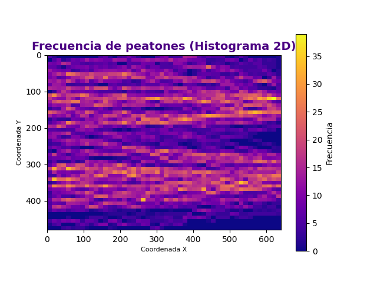
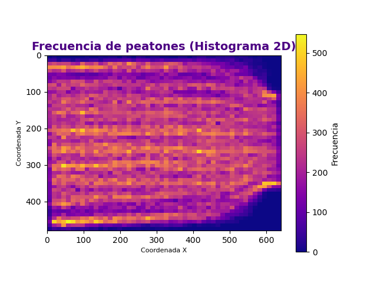

# Laboratorio 02: Cálculo de frecuencia peatonal 

## 1. Introducción 

El experimento con el que se trabajará se realizó dentro del proyecto *BaSiGo* (Bausteine ​​für die Sicherheit von Großveranstaltungen). El proyecto fue financiado por el Ministerio Federal de Educación e Investigación (BMBF) dentro del programa “Investigación para la Seguridad Civil”.

Este se llevó a cabo en nueve carreras en las que se varió la densidad de personas dentro del corredor cambiando los anchos (b_1 y b_2). Para acortar el tiempo de preparación entre las carreras individuales, los peatones fueron enviados alternativamente desde ambos lados por la geometría construida simétricamente.

### 1.1 Justificación 

El estudio de los flujos peatonales en ciertos espacios urbanos presenta una alta importancia debido a que permite optimizar el diseño y planificación de infraestructuras, además:
- Tener espacios públicos eficientes (metros, por ejemplo) mejora considerablemente el flujo peatonal, permitiendo brindar una mayor satisfacción y mejor experiencia a los usuarios.
- Estos estudios permiten también mejorar la seguridad de los peatones, identificando los puntos de conflicto y como se mueven las personas.

### 1.3 Objetivos 

**Objetivo General**

Procesar la base de datos para obtener la frecuencia por la que pasa un peatón por cada píxel y evaluar las opciones de lograrlo.

**Objetivos específicos**

1. Explorar y entender la base de datos.
2. Limpiar y extraer los datos necesarios, en este caso las coordenadas a utilizar.
3. Manipular los datos filtrados según lo solicitado (transformar de metros a pixeles).
4. Confeccionar mapas de calor para un análisis más interactivo.

## 2. Marco teórico

A continuación, se presentan una serie de herramientas, estructuras y librerías que se utilizarán a lo largo del laboratorio:

*Conda*: Se usará para la gestión de paquetes, ya sea buscar, instalar, actualizar o eliminarlos. A su vez permitirá crear y gestionar entornos virtuales que contendrá las bibliotecas necesarias para un proyecto en específico.

*Ipython*: Permitirá que la programación mediante Python se vuelva más eficiente e interactiva, utilizando diversas bibliotecas de análisis de datos.

*Visual Studio*: Es el entorno de desarrollo integrado (IDE) a usar que permitirá editar, depurar y compilar códigos para su posterior análisis.

*Numpy*: Esta librería proporciona distintas operaciones numéricas, matriciales y arreglos multidimensionales. Además, permite realizar arreglos más eficientes que las listas tradicionales de Python.

*Matplotlib*: Esta librería entrega múltiples códigos para realizar distintos tipos de gráficos, en este laboratorio se utilizara el gráfico de calor.

*Pandas*: Es una librería que permitirá cargar, manipular y visualizar datos secuenciales, como series temporales y micromatrices.

## 3. Materiales y métodos

Para la confección de este laboratorio se utilizarán dos dataset identificados como "UNI_CORR_500_01.txt" y "UNI_CORR_500_07.txt", los cuales son archivos de texto que contienen cinco columnas, las primeras dos corresponden a identificadores y las tres restantes son las coordenadas (X, Y y Z) las cuales serán procesadas. Estos datos (coordenadas) corresponden a datos de tipo float. Para este archivo las medidas correspondientes a b_1 y b_2 para los archivos de texto 1 y 2 es de 1,00 y 5,00 metros, y 5,00 y 3,00 metros respectivamente.

Para lograr identificar con qué frecuencia pasan las personas por ciertos puntos del corredor se manipularán ambos dataset y así obtener lo necesario para generar una visualización para su posterior análisis

En primer lugar (Para la ejecución con ciclo *for*), se realiza una exploración y extracción de los datos requeridos del dataset. Se realizan una serie de códigos para obtener la línea de las coordenadas X, Y y Z según lo especificado. Todo lo anterior utilizando listas y ciclos *for*.

Luego, con los datos extraídos en la parte anterior, se calcularán las frecuencias de las coordenadas X, Y, y ambas en conjunto, con el objetivo de identificar los puntos más repetitivos y en cuantas oportunidades. Se realizará usando principalmente diccionarios y ciclos *for*.

A continuación, se procede a realizar el cambio de las coordenadas de metro a pixeles. Para efecto de esto se calculará la pendiente según X e Y teniendo en consideración las coordenadas ya conocidas de metros y pixeles. Teniendo las pendientes es posible obtener los pixeles de una coordenada en metros cualquiera. Para esto se utilizaran funciones y listas.

Finalmente se ingresaran los valores de las coordenadas en un diccionario para posteriormente calcular las frecuencias de cada una, de esta manera se podrá identificar el conjunto de coordenadas que más se repite. Como se mencionó se usaran diccionarios, ciclos *for* y listas.

También se realizará mediante el uso de Pandas, estableciendo el dataset como dataframe. De esta manera se evitan todos los pasos anteriores del ciclo *for*, ya que se podrán extraer las columnas requeridas para el mapa de color sin extender el código.

Para ambos casos en cada dataset utilizado se elaborarán mapas de color para analizar el flujo de los peatones en los corredores y evaluar el codigo mas óptimo.

## 4. Resultados obtenidos

Luego de realizar, ejecutar y corroborar que el código funciona correctamente se obtienen los siguientes resultados en las métricas de rendimiento:

| Tipo de Experimento   | Tiempo de ejecucion (seg) |  Memoria utilizada (Mb) |
|-----------------------|---------------------------|-------------------------|
| Programa 1 (Archivo_1.py) | 0.806511402130127         | 120.69921875        |
| Programa 2 (Archivo_1.py)|  0.1570277214050293  |   129.77734375  |
| Programa 1 (Archivo_2.py)|  6.3635852336883545  |   120.4296875   |
| Programa 2 (Archivo_2.py)|  0.5664870738983154  |   132.65625   |

El 'Archivo_1' corresponde a los códigos con ciclo *for* y Pandas utilizando el dataset "UNI_CORR_500_01.txt" y para el 'Archivo_2' de igual manera se tienen los códigos con ciclo *for* y Pandas pero en este caso para el data set "UNI_CORR_500_07.txt".

Analizando los tiempos de ejecución se observa que los correspondientes a los programas 1 (ciclo *for*) para ambos dataset son más altos que los programas 2 (Pandas), principalmente por los extensos códigos. Aún asi, la memoria uilizada por los programas 2 es mayor a la utilizada por los programas 1, esto se debe a que se requieren mas librerías.

A continuación, se presenta el mapa de color (Archivo_1) obtenido con las frecuencias en pixeles de las coordenadas X e Y del dataset, permitiendo identificar los pixeles que más se repiten. Este mapa es obtenido con ambos códigos.

Teniendo en consideración que en centro derecho se encontraba una persona parada, se explica porque se separa el flujo de derecha a izquierda, para luego expandirse por el resto del corredor.

Tambien se presenta el mapa de color correspondiente al 'Archivo_2' mediante ambos codigos. En este caso el mapa se ve mas uniforme, donde (de izquierda a derecha) se aprecia el recorrido de los peatones desde una entrada amplia a una salida más estrecha.

## 5. Conclusiones

Con la confección de este laboratorio se pudieron esclarecer ciertas cosas para el código con cliclo *for* como por ejemplo, es más práctico y rápido la extracción de caracteres de una lista de acuerdo al índice que crear listas nuevas usando ciclo *for*, de esta manera se evitan una serie de códigos extensos y que el tiempo de procesamiento aumente.

También se corrobora la eficiencia del uso de los diccionarios, que permite relacionar las coordenadas con sus respectivas repeticiones, sin necesidad de crear dos lista por separado. Además se puede apreciar que, a diferencia de usar un ciclo *for*, el uso de funciones permite realizar los cálculos necesarios sin necesidad de aumentar la memoria en uso, ya que mientras no se llame a esta, no ocupa memoria.

De igual manera al realizar el código usando la librería Pandas se comprueba que dimensión de los códigos se reducen considerablemente al igual que el tiempo de ejecución del programa a pesar de tener que sacrificar un poco más de memoria. Con dataframe se evitan utilizar múltiples ciclos *for*, listas y diccionarios para extraer columnas y formar la matriz de frecuencia.

