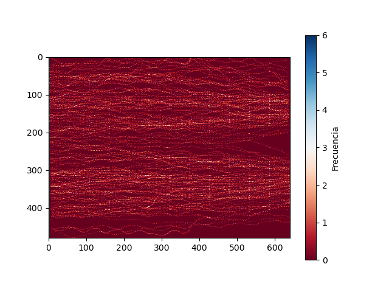

# Laboratorio 01: Cálculo de frecuencia peatonal 

## 1. Introducción 

El experimento con el que se trabajará se realizó dentro del proyecto *BaSiGo* (Bausteine ​​für die Sicherheit von Großveranstaltungen). El proyecto fue financiado por el Ministerio Federal de Educación e Investigación (BMBF) dentro del programa “Investigación para la Seguridad Civil”.

Este se llevó a cabo en nueve carreras en las que se varió la densidad de personas dentro del corredor cambiando los anchos (b_1 y b_2). Para acortar el tiempo de preparación entre las carreras individuales, los peatones fueron enviados alternativamente desde ambos lados por la geometría construida simétricamente.

### 1.1 Justificación 

El estudio de los flujos peatonales en ciertos espacios urbanos presenta una alta importancia debido a que permite optimizar el diseño y planificación de infraestructuras, además:
- Tener espacios públicos eficientes (metros, por ejemplo) mejora considerablemente el flujo peatonal, permitiendo brindar una mayor satisfacción y mejor experiencia a los usuarios.
- Estos estudios permiten también mejorar la seguridad de los peatones, identificando los puntos de conflicto y como se mueven las personas.

### 1.3 Objetivos 

**Objetivo General**

Procesar la base de datos para obtener la frecuencia por la que pasa un peatón por cada píxel.

**Objetivos específicos**

1. Explorar y entender la base de datos.
2. Limpiar y extraer los datos necesarios, en este caso las coordenadas a utilizar.
3. Manipular los datos filtrados según lo solicitado (transformar de metros a pixeles).
4. Confeccionar mapas de calor para un análisis más interactivo.

## 2. Marco teórico

A continuación, se presentan una serie de herramientas, estructuras y librerías que se utilizarán a lo largo del laboratorio:

*Conda*: Se usará para la gestión de paquetes, ya sea buscar, instalar, actualizar o eliminarlos. A su vez permitirá crear y gestionar entornos virtuales que contendrá las bibliotecas necesarias para un proyecto en específico.

*Ipython*: Permitirá que la programación mediante Python se vuelva más eficiente e interactiva, utilizando diversas bibliotecas de análisis de datos.

*Visual Studio*: Es el entorno de desarrollo integrado (IDE) a usar que permitirá editar, depurar y compilar códigos para su posterior análisis.

*Numpy*: Esta librería proporciona distintas operaciones numéricas, matriciales y arreglos multidimensionales. Además, permite realizar arreglos más eficientes que las listas tradicionales de Python.

*Matplotlib*: Esta librería entrega múltiples códigos para realizar distintos tipos de gráficos, en este laboratorio se utilizara el gráfico de calor.

## 3. Materiales y métodos

Para la confección de este laboratorio se utilizará un dataset identificado como "UNI_CORR_500_01.txt", el cual es un archivo de texto que contiene cinco columnas, las primeras dos corresponden a identificadores y las tres restantes son las coordenadas (X, Y y Z) las cuales serán procesadas. Estos datos (coordenadas) corresponden a datos de tipo float. Para este archivo la medida correspondiente a b_1 y b_2 es de 1,00 y 5,00 metros respectivamente.

Para lograr identificar con qué frecuencia pasan las personas por ciertos puntos del corredor se manipulo el dataset y así obtener lo necesario para generar una visualización para su posterior análisis

En primer lugar, se realiza una exploración y extracción de los datos requeridos del dataset. Se realizan una serie de códigos para obtener la línea de las coordenadas X, Y y Z según lo especificado. Todo lo anterior utilizando listas y ciclos *for*.

Luego, con los datos extraídos en la parte anterior, se calcularán las frecuencias de las coordenadas X, Y, y ambas en conjunto, con el objetivo de identificar los puntos más repetitivos y en cuantas oportunidades. Se realizará usando principalmente diccionarios y ciclos *for*.

A continuación, se procede a realizar el cambio de las coordenadas de metro a pixeles. Para efecto de esto se calculará la pendiente según X e Y teniendo en consideración las coordenadas ya conocidas de metros y pixeles. Teniendo las pendientes es posible obtener los pixeles de una coordenada en metros cualquiera. Para esto se utilizaran funciones y listas.

Finalmente se ingresaran los valores de las coordenadas en un diccionario para posteriormente calcular las frecuencias de cada una, de esta manera se podrá identificar el conjunto de coordenadas que más se repite. Como se mencionó se usaran diccionarios, ciclos *for* y listas.

Como extra también se identificarán los mínimos, máximos y varianzas de X e Y mediante el uso de la biblioteca Numpy. De igual manera esta biblioteca se utilizará en conjunto con Matplotlib para graficar un mapa de calor que permita visualizar el movimiento de las personas en el corredor según los pixeles.

## 4. Resultados obtenidos

Luego de realizar, ejecutar y corroborar que el código funciona correctamente se obtienen los siguientes resultados en las métricas de rendimiento:

| Tipo de Experimento   | Tiempo de ejecucion (seg) |  Memoria utilizada (Mb) |
|-----------------------|---------------------------|-------------------------|
| Programa Uno (Lab01.py) |  4.769325256347656               |       95.10546875                  |

El uso de memoria residente se encuentra expresado en la tabla anterior con un valor de 95.10 MB aproximadamente, de igual manera se obtuvo el uso de memoria virtual el cual corresponde a 89.296875 MB y el porcentaje de uso de la CPU del programa es de 6.675%.

En la siguiente tabla se presentan algunos indicadores de las coordenadas X e Y en pixeles, como el mínimo valor, el máximo valor, la varianza de cada una y sus medianas.

| Coordenada en pixel   | Min |  Max |  Varianza |  Mediana |
|-----------------------|---------------|----------|------------|------|
| **X** |  124      |    486     |   10482.062816366419 | 299 |
| **Y** |  28       |    459     |   12129.647296604257 | 235 |

A continuación, se presenta el mapa de calor obtenido con las frecuencias en pixeles de las coordenadas X e Y del dataset, permitiendo identificar los pixeles que más se repiten. 

Se puede apreciar que en los extremos (como la coordenada (640, 480)) el paso de los peatones es casi nulo y la mayor concentración se mantiene más centrada. En conjunto con la tabla anterior se comprueba que a lo largo del eje X la varianza es menor que en el eje Y, ya que los peatones se mueven hacia los costados para llegar al otro extremo.

## 5. Conclusiones

Con la confección de este laboratorio se pudieron esclarecer ciertas cosas como, por ejemplo, es más práctico y rápido la extracción de caracteres de una lista de acuerdo al índice que crear listas nuevas usando ciclo *for*, de esta manera se evitan una serie de códigos extensos y que el tiempo de procesamiento aumente.

También se corrobora la eficiencia del uso de los diccionarios, que permite relacionar las coordenadas con sus respectivas repeticiones, sin necesidad de crear dos lista por separado.

Finalmente se puede apreciar que, a diferencia de usar un ciclo *for*, el uso de funciones permite realizar los cálculos necesarios sin necesidad de aumentar la memoria en uso, ya que mientras no se llame a esta, no ocupa memoria.

